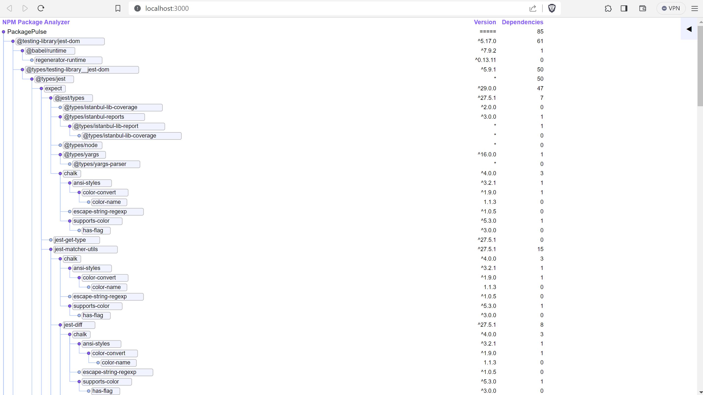
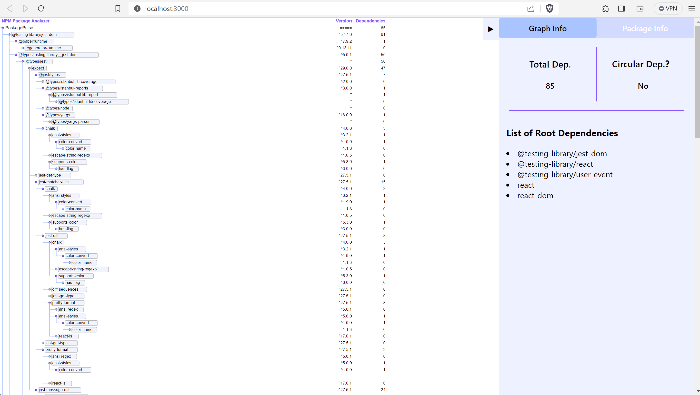

# PackagePulse

## Introduction

PackagePulse is a tool for visualizing npm package dependencies. It analyzes the package.json file in the root directory and search for all dependencies recursively, then opens the browser and renders the dependency tree. Currently, this project analyzes its own package.json file. 

This project is developed with React, Node.js and Express. Visualization is done using [D3](https://d3js.org/).

## Getting Started

1. Clone the repository.
2. Open the terminal and navigate to project root directory.
3. Simply run ```npm start```.

## Page Preview
You can see the depedency tree on [localhost:3000](localhost:3000). You can expand and collapse each subtree by clicking on a node:



You can also open the inspector on the right and see a summary of all dependencies:

